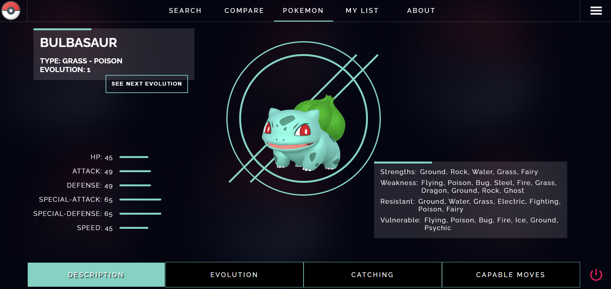

# Pokedex App



A fully functional Pokedex app built with React, Redux Toolkit, TypeScript, Firebase, and SCSS. This project covers various aspects of web development, including React Hooks, React Router, CSS3 & SCSS, TypeScript, Redux and Redux Toolkit, Firebase Firestore, Axios for API integration, and best practices for components and file structure.

## Features

- Browse and search for Pokemon by name or number.
- View detailed information about each Pokemon, including its type, abilities, stats, and evolution chain.
- Mark Pokemon as favorites and access them easily.
- Filter Pokemon by their type.
- Sort Pokemon by name, number, or base experience.
- Pagination for efficient loading and browsing of large datasets.

## Technologies Used

- React: A JavaScript library for building user interfaces.
- Redux Toolkit: A package that simplifies the usage of Redux by providing pre-configured tools and abstractions.
- TypeScript: A statically typed superset of JavaScript that enhances code quality and developer productivity.
- Firebase: A comprehensive platform for developing web and mobile applications, including authentication, real-time database, and hosting.
- SCSS: A powerful extension of CSS that allows for more flexibility and modularity in styling.
- React Hooks: A feature introduced in React 16.8 that enables stateful logic in functional components.
- React Router: A library for routing and navigation in React applications.
- Axios: A promise-based HTTP client for making API requests.
- Firestore: A flexible, scalable database from Firebase that enables efficient data storage and retrieval.

## Installation

1. Clone the repository:

```bash
git clone https://github.com/seo-asif/Enterprise-level-pokemon-app.git
```

2. Navigate to the project directory:

```bash
cd pokedex-app
```

3. Install the dependencies:

```bash
npm install
```

4. Create a Firebase project and set up Firestore. Obtain your Firebase configuration details.

5. Create a `.env` file in the project root directory and add the following:

```bash
REACT_APP_FIREBASE_API_KEY=YOUR_FIREBASE_API_KEY
REACT_APP_FIREBASE_AUTH_DOMAIN=YOUR_FIREBASE_AUTH_DOMAIN
REACT_APP_FIREBASE_PROJECT_ID=YOUR_FIREBASE_PROJECT_ID
REACT_APP_FIREBASE_STORAGE_BUCKET=YOUR_FIREBASE_STORAGE_BUCKET
REACT_APP_FIREBASE_MESSAGING_SENDER_ID=YOUR_FIREBASE_MESSAGING_SENDER_ID
REACT_APP_FIREBASE_APP_ID=YOUR_FIREBASE_APP_ID
REACT_APP_FIREBASE_MEASUREMENT_ID=YOUR_FIREBASE_MEASUREMENT_ID
```

Replace the `YOUR_` placeholders with your actual Firebase configuration values.

6. Start the development server:

```bash
npm start
```

The app will be accessible at `http://localhost:3000`.

## Deployment

To deploy the application to a website, follow these steps:

1. Build the app:

```bash
npm run build
```

This command creates a `build` directory with optimized production-ready files.

2. Choose a hosting service for your application. Firebase Hosting is a popular option.

3. Configure hosting for your Firebase project and deploy the app.

For Firebase Hosting, follow these steps:

- Install the Firebase CLI:

```bash
npm install -g firebase-tools
```

- Authenticate with Firebase:

```bash
firebase login
```

- Initialize your project:

```bash
firebase init
```

- Choose the hosting option and configure it according to your preferences.

- Deploy the app:

```bash
firebase deploy
```

The app will be deployed to your chosen hosting service, and you'll receive a URL to access it.

This file structure represents a suggested organization for the project. However, feel free to modify it based on your preferences and project needs.

## Contributing

Contributions are welcome! If you have any ideas, suggestions, or bug fixes, please open an issue or submit a pull request.

## License

This project is licensed under the [MIT License](LICENSE).

---

Happy coding! If you have any questions, feel free to reach out.
